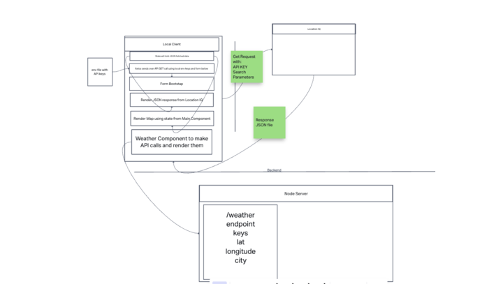

# City-Explorer-API

**Author**: Kao Saelor

**Version**: 1.0.0 (increment the patch/fix version number if you make more commits past your first submission)

## Overview
This application is a web-based tool that provides weather forecasts and location-based data for cities around the world. It consists of a custom API server built using Node.js, npm, and Express.js, and a front-end application built using React.js and Axios. The goal is to provide users with a reliable and user-friendly tool for accessing weather and location-based data.

## Getting Started
To hook up a front-end React application with a back-end server, you can create an Express server from scratch. Here are the steps:

- Install Node.js
- Create a new project directory
- Initialize a new Node.js project
- Install Express
- Create an index.js file to serve as the entry point for your Express server
- Define routes to handle incoming requests
- Start the server

Once the server is up and running, make HTTP requests to it from your React components using libraries like axios or fetch

## Architecture
The application is designed with Node.js, npm, Express.js, and dotenv for the back-end, and React.js and Axios for the front-end. Node.js runs the server-side, npm manages dependencies, Express.js builds the API, and dotenv handles sensitive information. React.js creates reusable UI components and manages application state, while Axios makes HTTP requests.

## Change Log
4-18-2023 1:00pm - Set up React repository, intall required dependencies, set up .gitignore and .eslintric.json and created weather.json file.

4-18-2023 3:00pm - Created Express server and API endpoint.

4-18-2023 4:00pm - Coded the require statement, GET request using lat/lon and searchQuery, created a class for Forecase with properties of date and description as well as minTemp and maxTemp.

4-18-2023 6:00pm - Tested endpoint in browser to verify that raw response object is rendering correctly.

4-18-2023 7:00pm - Created weather.js component to render forecase data in browser.

4-18-2023 9:00pm - Added styling and polish code.

## Credit and Collaborations
Instructors: Aubrey Patterson & JB Tellez

TA: Tammy D. and Raul Z.

Teammates: Kenya W., Coriana W., Isabel S., and Hayden C.

**Time Estimates**

For each of the lab features, make an estimate of the time it will take you to complete the feature, and record your start and finish times for that feature:

Name of feature: Lab 7 Custom Servers with Node and Express Features 1 - 3.

Estimate of time needed to complete: 4 hours

Start time: 1 pm

Finish time: 9 pm

Actual time needed to complete: 8 pm

**WRRC**

## Lab 8
**Time Estimates**

For each of the lab features, make an estimate of the time it will take you to complete the feature, and record your start and finish times for that feature:

Name of feature: Lab 8 Feature 1 - 3

Estimate of time needed to complete: 6 hours

Start time: 1 pm

Finish time: 10 pm

Actual time needed to complete: 9 hours
